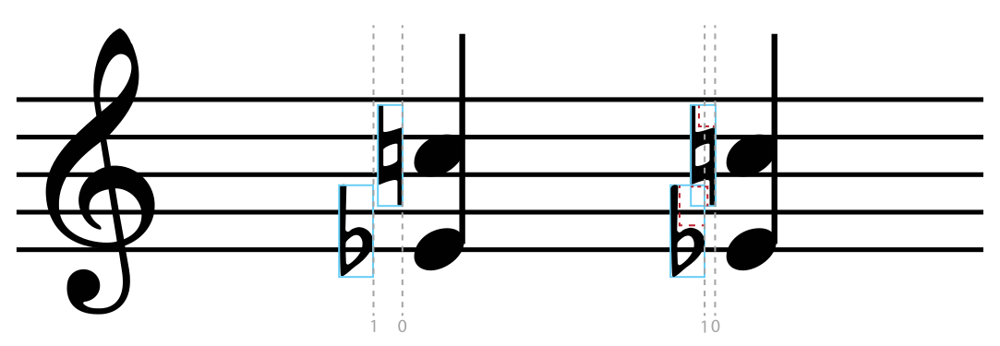
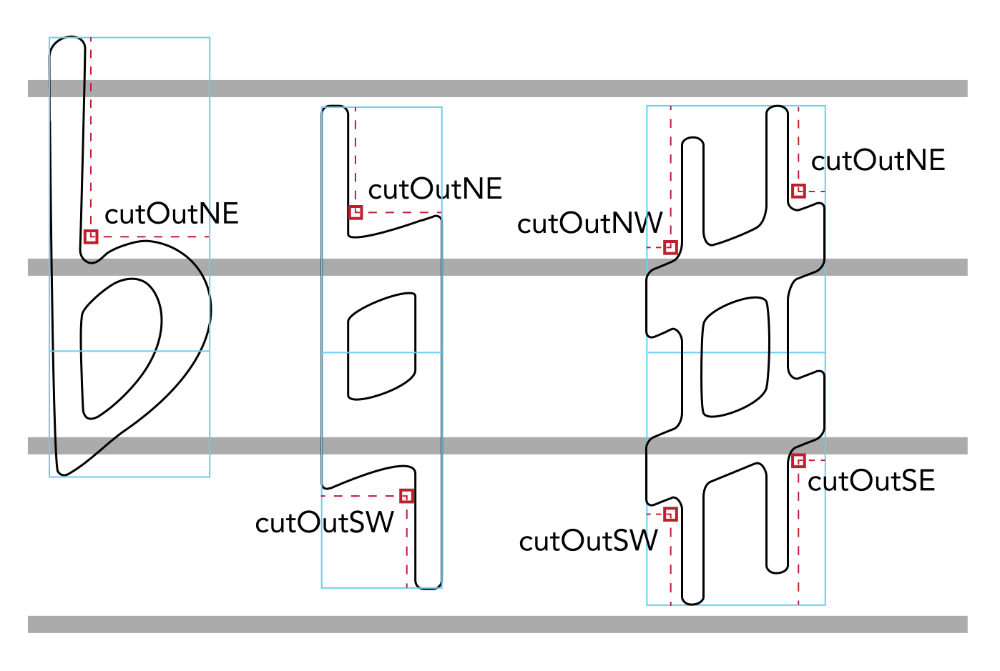

Bounding box cut-outs
---------------------

The four points cutOutNE, cutOutSE, cutOutSW and cutOutNW describe
rectangular cut-outs from the four corners of a glyph’s rectangular
bounding box. The bounding box is the box with the smallest area that
encloses every part of the path of a glyph.

Because a glyph may not occupy every part of its bounding box, it can be
useful to have an extra level of detail about the shape of the glyph,
but at a coarser level than directly examining the path of the glyph to
determine which areas of the bounding box are occupied and which are
empty.

For example, when stacking accidentals to the left of a chord,
accidentals are arranged into columns, where accidentals belonging to
notes separated by a wide interval (normally a seventh or more) are
aligned in the same column, i.e. at the same horizontal position.
Successive columns of accidentals are laid out from right to left to the
left of a chord, and depending on the accidentals that are present, it
may be possible to interlock or kern those columns. The figure below
shows a simple example:

In the first chord above, the two columns of accidentals (numbered 0 and
1) are positioned almost as close as the bounding boxes of the
accidentals (shown in light blue) in each column will allow. In the
second chord, column 1 is allowed to interlock with column 0 because the
cut-outs in the bounding boxes of the two accidentals (shown as dashed
red lines) are removed: the bounding boxes of the accidentals can
overlap, provided it is only the cut-outs that overlap.

Font designers can specify four cut-outs to the bounding box, one in
each corner, as illustrated in the figure below:

Each cut-out is specified as a pair of X,Y coordinates (in spaces),
describing the innermost corner of a nominal rectangle that intersects
the bounding box. For example, cutOutNE specifies the bottom left corner
of a rectangle that intersects the top right corner of the bounding box
of the glyph. The positions of each of the other corners of the cut-out
rectangle are calculated using the bounding box of the glyph.
