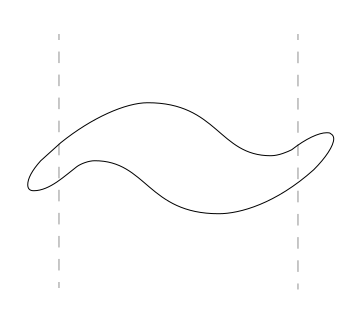
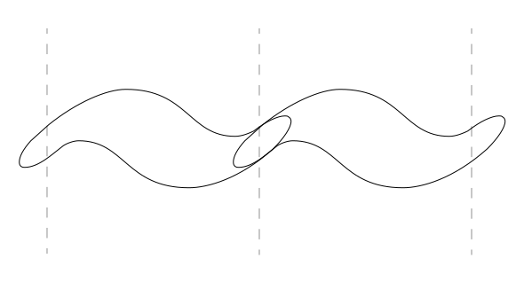

Repeat offsets
--------------

The repeatOffset point is defined for glyphs that are designed to
tessellate, such as the wiggly line that follows the
 symbol, or any of the glyphs in the
**Multi-segment lines** range.

These glyphs are registered such that they may have negative side
bearings on either or both the left- and right-hand sides. When entered
in a run of text, the advance width produces the correct tessellation.
However, in some situations it may not be possible to use a run of text
to draw such a line, or the API in use may not provide easy access to
the advance width of a glyph (e.g. when using the HTML canvas element).

In these situations, correct tessellation can be achieved by positioning
the origin of subsequent glyphs in a tessellating line at the horizontal
position defined by the **repeatOffset** point for a given glyph.

Here, for example, is an illustration of the glyph **wiggleTrill**:

The vertical dashed lines show the left- and right-hand side bearings
for this glyph. The **repeatOffset** anchor’s coordinates are at the x
position of the right-hand side bearing and y = 0. Positioning another
**trillWiggle** glyph at the position of the **repeatOffset** anchor produces
correct tessellation, like this:

